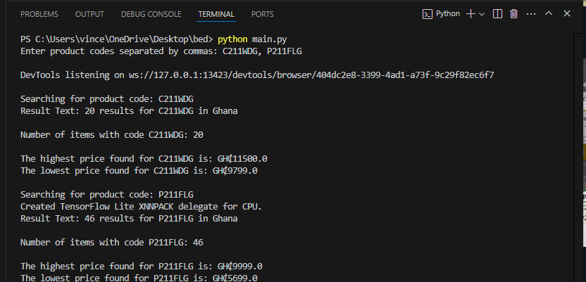
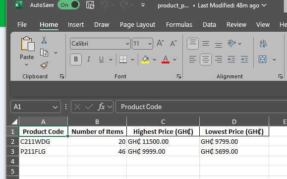

# Jiji Data Scraper

This project automates the process of scraping e-commerce data from the Jiji platform, specifically focused on product codes, prices, locations, and conditions.

## Features
- **Data Fetching**: Scrapes product details using the product codes.
- **Data Processing**: Captures and organizes data, including prices, locations, and product conditions.
- **Export Options**: Exports the data to both CSV and Excel formats.
- **Infinite Scrolling**: Implements infinite scrolling to ensure complete data extraction.
- **Automated Column Adjustment**: Automatically adjusts column widths in the Excel file for better readability.

## How to Run
1. Clone this repository.
2. Install the required dependencies:
   ```bash
    pip install -r requirements.txt
    python scraper.py





## Notes
- Ensure you have ChromeDriver installed or the appropriate webdriver for your browser version.
- The project uses Selenium to perform browser automation for scraping.